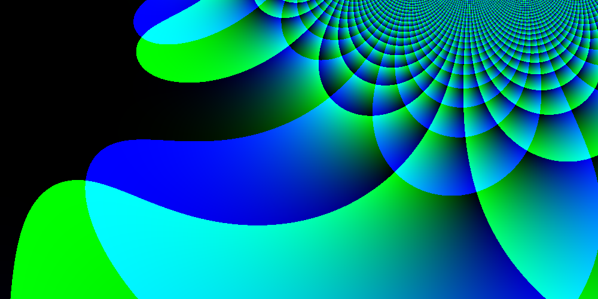
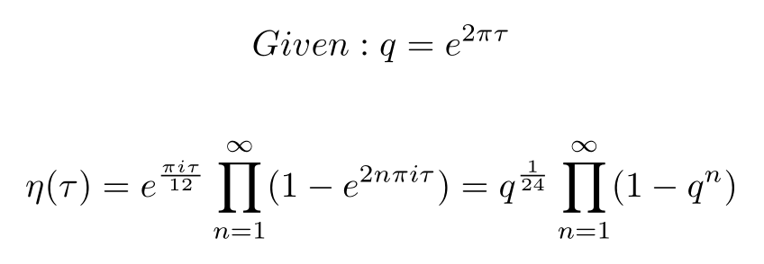

<p align="center">
  
</p>

## Overview

One of the most important problems in mathematics is the effort to find the
relations between the individual disciplines. As it stands, there are some
branches of mathematics that are completely isolated from the others.
Researchers are searching for (and finding!) bridges between the disparate
fields of math and many believe that the ultimate fate is to find some unifying
theory of mathematics: The same project that physicists are trying to complete
in their own discipline.

One of the important bridges linking mathematics together is Fermat's Last
Theorem. The theorem, which was proven in 1994 (358 years after the problem was
first stated), is closely related to modular forms through the Taniyama-Shimura
conjecture. This conjecture suggested another link between two areas of
mathematics: elliptic curves and modular forms. Before getting too far ahead
into modular forms though, it is important to me to establish a basis in
modular arithmetic.

Modular arithmetic is something almost all programmers are familiar with.
Non-programmers might call this "clock arithmetic" or remainder arithmetic. A
system is modular basically any time you can return a value to its initial
state using only addition operations. Modular arithmetic and periodicity are
highly related, and modular arithmetic is also highly related to complex
analysis through Euler's formula which reveals the surprising link between
complex numbers and trigonometry.

The field of modular forms is a consequence of applying a particular symmetry
condition to functions in the complex domain that obey the rules of modular
arithmetic. This program is concerned with a particular kind of modular form
called the Dedekind eta function. More information about modular forms and the
Dedekind eta function can be found on Wikipedia.

The main thing that one needs to know about this function in order to
understand the code in this repository is the following formula:

<p align="center">
  
<p>

As for writing the actual program, that was pretty easy after I spent some time
learning about the complex number facilities in C. It turns out, there are a
number of functions in `complex.h`, the details of which can be found in
`complex(7)`. I thought that the function itself would end up being much more
complicated than it was, and that kind of defied my expectations. I also didn't
anticipate the amount of processing power the images would require to generate.
I'm used to image generation being practically instantaneous, but these images
actually take some time to render.

## Usage

Here is the usage message that this program prints out. It is relatively
straightforward, but it is worth explaining the `iterations` option. Basically,
the proper way to evaluate these functions is to take a product from `n=1` to
`n=∞`, but since I don't have an infinite amount of compute resources I have to
compromise, therefore, `-n` is used to specify how many iterations will be
evaluated.

```
Usage: ./build/dedekind_eta [-n iterations] [-x width] [-y height] [-o outFile]
 -n     Number of iterations.
 -x     Image width.
 -y     Image height.
 -o     Output file.
 -h     Print this usage message.
```

## Gif Generation

In order to produce the `.gif` in the `res` directory, I put together a script
that would generate images with successively larger `-n` values. The script
would then stitch these images together into an animated gif using convert.
This script isn't really production ready, it's just an example of a way you
could use this program.

## Rendering

In order to render the output image, I use the very simple and easy to use
`.tga` file format. This format is essentially just a header followed by a
memory dump of the buffer as one would normally lay it out in C, except with
the unusual order of blue, green, red, alpha instead of red, green, blue,
alpha.

I made an artistic decision to have the real part be the blue channel, the
imaginary part be the green channel, and left the red channel as zero. There
are likely other ways to style the output for even better results.

## Dependencies

```
gcc
make
an image viewer that can handle .tga files.
```

## License

This work is licensed under the GNU General Public License version 3 (GPLv3).

[](https://www.gnu.org/licenses/gpl-3.0.en.html)
